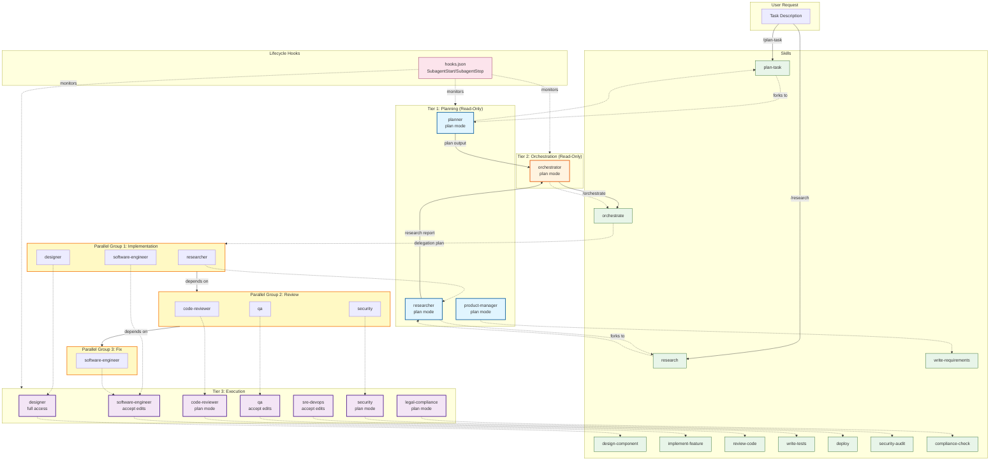

# Software Development Agent Team Plugin

A Claude Code plugin that provides a **3-tier agent team** for collaborative software development. The plugin includes 11 specialized agents and 11 matching skills that work together in a pipeline workflow: **Plan → Research/Orchestrate → Parallel execution**.

## What This Plugin Provides

### 11 Specialized Agents

**Tier 1 — Planning (read-only)**:

- `planner` - Strategic planner for task breakdown and roadmaps
- `researcher` - Research specialist for library docs, APIs, and specifications
- `product-manager` - Product manager for requirements and user stories

**Tier 2 — Orchestration (read-only)**:

- `orchestrator` - Workflow orchestrator for delegation planning and parallel execution

**Tier 3 — Execution**:

- `designer` - UI/UX designer for component specifications
- `software-engineer` - Software engineer for feature implementation
- `code-reviewer` - Code reviewer for quality and security checks
- `qa` - QA engineer for testing and bug finding
- `sre-devops` - SRE/DevOps engineer for infrastructure and deployment
- `security` - Security specialist for vulnerability audits
- `legal-compliance` - Legal compliance specialist for regulatory review

### 11 Matching Skills

- `/plan-task` - Create structured implementation plans
- `/orchestrate` - Produce delegation plans for parallel execution
- `/write-requirements` - Write user stories and acceptance criteria
- `/design-component` - Design UI components with specifications
- `/implement-feature` - Implement features following project patterns
- `/review-code` - Review code for quality and security
- `/write-tests` - Write unit, integration, and E2E tests
- `/deploy` - Deploy applications and manage infrastructure
- `/security-audit` - Perform security vulnerability audits
- `/compliance-check` - Check license compatibility and regulatory compliance
- `/research` - Research libraries, APIs, and best practices

## Pipeline Workflow

The standard workflow for complex tasks:

```text
Step 1: /plan-task [description]
  → Forks to planner agent (read-only)
  → Returns structured task plan with dependencies
  → May include research tasks for unfamiliar libraries/APIs

Step 1.5 (if needed): /research [topic]
  → Forks to researcher agent (read-only)
  → Searches web, reads docs, gathers reliable information
  → Returns structured report with sources and recommendations

Step 2: /orchestrate [plan output]
  → Forks to orchestrator agent (read-only)
  → Returns delegation plan with parallel groups
  → Schedules research tasks in earliest group when present

Step 3: Execute delegation plan
  → Main session spawns Tier 3 agents in parallel per group
  → Groups execute in dependency order
  → Review agents run after implementation agents
```

## Agent Architecture & Orchestration

The following diagram visualizes the 3-tier agent structure, agent-to-skill relationships, orchestration workflow, and parallel execution patterns:



**Legend:**

- **Solid arrows**: Direct agent delegation and data flow
- **Dashed arrows**: Skill invocations and agent-to-skill mappings
- **Tier colors**: Blue (Planning), Orange (Orchestration), Purple (Execution)
- **Groups**: Yellow boxes show parallel execution groups with dependencies

## Parallel Execution Patterns

**Fan-out / Fan-in**: Spawn multiple agents in parallel, collect results.

```text
Example: "Create an agent team to review this PR with security, code-reviewer, and qa agents in parallel"
```

**Pipeline**: Plan → Orchestrate → Parallel execution with quality gates.

```text
Example: "/plan-task Add WebSocket support" then "/orchestrate [plan]" then execute
```

**Iterative**: Loop between agents until quality criteria met.

```text
Example: "Have software-engineer implement and code-reviewer review, iterate until no critical issues"
```

## Installation

Install the plugin from the public repository [https://github.com/yu-iskw/software-development-team-plugin](https://github.com/yu-iskw/software-development-team-plugin).

### Option A — From GitHub (recommended)

1. Add this repo as a marketplace (in Claude Code or CLI):

   ```text
   /plugin marketplace add yu-iskw/software-development-team-plugin
   ```

2. Install the plugin (choose scope: user, project, or local as needed):

   ```text
   /plugin install software-development-team@software-development-team-plugin
   ```

   To set scope via CLI: `claude plugin install software-development-team@software-development-team-plugin --scope project`. See [Discover and install plugins](https://code.claude.com/docs/en/discover-plugins) for scope details.

### Option B — Local clone (development or one-off)

Clone the repo, then run Claude Code with the plugin directory:

```bash
claude --plugin-dir /path/to/software-development-team-plugin
```

Or from inside the clone:

```bash
claude --plugin-dir .
```

### Enable agent teams

Agent teams are required for the full Plan → Orchestrate → Execute pipeline. See [Orchestrate teams of Claude Code sessions](https://code.claude.com/docs/en/agent-teams).

#### Required: Environment variable

Set the following environment variable to enable agent teams:

```bash
export CLAUDE_CODE_EXPERIMENTAL_AGENT_TEAMS=1
```

Or add it to your project's `.claude/settings.json`:

```json
{
  "env": {
    "CLAUDE_CODE_EXPERIMENTAL_AGENT_TEAMS": "1"
  }
}
```

#### Optional: Recommended settings

For full functionality including lifecycle logging, copy the recommended settings from `docs/settings-recommended.json` into your project's `.claude/settings.json`. This includes:

- Environment variable for agent teams
- Permission allow-list for all 11 skills
- SubagentStart/SubagentStop hooks for lifecycle logging

The recommended settings file provides:

- Skill permissions for all team skills
- Lifecycle hooks that log when agents start/stop (useful for debugging and monitoring)

**Note**: SubagentStart/SubagentStop hooks are configured in project-level `.claude/settings.json` (not in the plugin's `hooks/hooks.json`) as they are agent-teams-specific features.

### Documentation

- [Plugins reference](https://code.claude.com/docs/en/plugins-reference)
- [Agent teams](https://code.claude.com/docs/en/agent-teams)

## Usage Examples

### Basic Planning Workflow

```text
/plan-task Add user authentication with OAuth2

→ Planner agent creates a structured plan
→ Plan includes research task for OAuth2 library
→ Plan identifies all affected components
```

### Full Pipeline Execution

```text
/plan-task Add WebSocket support for real-time updates
/orchestrate [plan output]

→ Orchestrator creates parallel groups:
  Group 1: researcher (OAuth2 docs), software-engineer (backend), designer (UI)
  Group 2: code-reviewer, qa, security (parallel reviews)
  Group 3: software-engineer (fix issues from reviews)
```

### Parallel Review

```text
Create an agent team to review PR #42:
- code-reviewer: Review code quality
- security: Security audit
- qa: Test coverage review

→ All three agents run in parallel
→ Results are collected and synthesized
```

## Repository Layout

```text
.claude-plugin/
  plugin.json                    # Plugin metadata with agent/skill/hook paths
  marketplace.json               # Marketplace catalog for install-from-GitHub
agents/
  planner.md                     # Strategic planner agent
  orchestrator.md                # Workflow orchestrator agent
  product-manager.md             # Product manager agent
  designer.md                    # UI/UX designer agent
  software-engineer.md           # Software engineer agent
  code-reviewer.md               # Code reviewer agent
  qa.md                          # QA engineer agent
  sre-devops.md                  # SRE/DevOps agent
  security.md                    # Security specialist agent
  legal-compliance.md            # Legal compliance agent
  researcher.md                  # Research specialist agent
  say-hello-agent.md             # Example agent (kept for reference)
skills/
  plan-task/SKILL.md            # Planning skill
  orchestrate/SKILL.md           # Orchestration skill
  write-requirements/SKILL.md   # Requirements skill
  design-component/SKILL.md      # Design skill
  implement-feature/SKILL.md     # Implementation skill
  review-code/SKILL.md          # Code review skill
  write-tests/SKILL.md          # Testing skill
  deploy/SKILL.md                # Deployment skill
  security-audit/SKILL.md        # Security audit skill
  compliance-check/SKILL.md      # Compliance check skill
  research/SKILL.md             # Research skill
  hello-world/SKILL.md          # Example skill (kept for reference)
hooks/
  hooks.json                     # Hook configuration
docs/
  settings-recommended.json     # Recommended project settings
integration_tests/
  Dockerfile                     # Smoke test image
  run.sh                         # Orchestrates integration scripts
  validate-manifest.sh
  test-plugin-loading.sh
  test-component-discovery.sh
```

## Quickstart

1. **Install the plugin**: Follow [Installation](#installation) (add the repo as a marketplace, then install `software-development-team@software-development-team-plugin`, or use `--plugin-dir` with a local clone).
2. **Enable agent teams**: Set `CLAUDE_CODE_EXPERIMENTAL_AGENT_TEAMS=1` in your environment or `.claude/settings.json`
3. **Optional**: Copy recommended settings from `docs/settings-recommended.json` to your project's `.claude/settings.json`
4. **Use the skills**: Start with `/plan-task` to create a plan, then `/orchestrate` to delegate work across agents

## Developing This Plugin

See [CONTRIBUTING.md](CONTRIBUTING.md) for contribution guidelines. Useful commands and workflows:

### Local Development Commands

- `make format`: format files with Trunk
- `make lint`: run all linters via Trunk
- `make test-integration-docker`: run integration tests in Docker

You can also run integration tests directly:

- `./integration_tests/run.sh`
- `./integration_tests/run.sh --manifest-only`
- `./integration_tests/run.sh --verbose`

## CI

GitHub Actions includes:

- `.github/workflows/trunk_check.yml`: lint and static checks
- `.github/workflows/integration_tests.yml`: manifest validation and plugin loading smoke tests
- `.github/workflows/trunk_upgrade.yml`: weekly Trunk dependency updates

## Release

1. Update `.claude-plugin/plugin.json` version.
2. Tag and publish a release.
3. Share your repository as the plugin entry point.

## References

- [Plugins reference](https://code.claude.com/docs/en/plugins-reference)
- [Agent teams](https://code.claude.com/docs/en/agent-teams)
- [Claude Code Plugins Documentation](https://code.claude.com/docs/en/plugins)
- Based on [PR #114](https://github.com/yu-iskw/llmops-demo-ts/pull/114) agent team implementation

## License

Apache License 2.0. See `LICENSE`.
